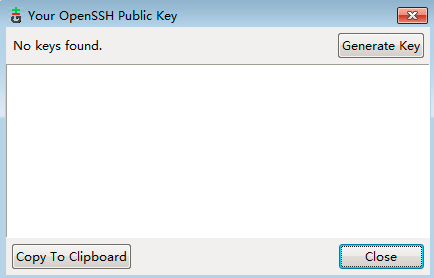

Git is a version control system and allows you to save copies of your code throughout the entire developmental process.

GitHub allows you to push your code from your local workspace to be hosted online. 

-Register an account on [GitHub](https://github.com), create a repository, say, tools
- Download and install platform-specific version of git from [git-scm](http://git-scm.com/downloads)
- Git configure: open the bash version of git and type:

```
git config --global user.name 'your_username'
git config --global user.email 'your_email_in_github'
```

- Generate ssh key: open git-gui, click help --> show ssh key, if not exist, generate one, and copy to clipboard.



- Add ssh key to github: in github website, settings --> ssh keys --> add ssh key
- Open rstudio and set the path to git executable: tools --> global options --> git/svn


- version control in rstudio
    * in github website, copy the repository path (https://github.com/rhohz/tools)
	  * in rstudio, file --> new project --> version control -- git, paste repository path below 'repository url'
	  
- Commit and push: 
    * right to git token, select 'commit' (or Ctrl + alt + M), check the files to commit, fill in something in commit message, and click commit
	  * click push, fill in uername and passward

- open an existed project: file --> open project
